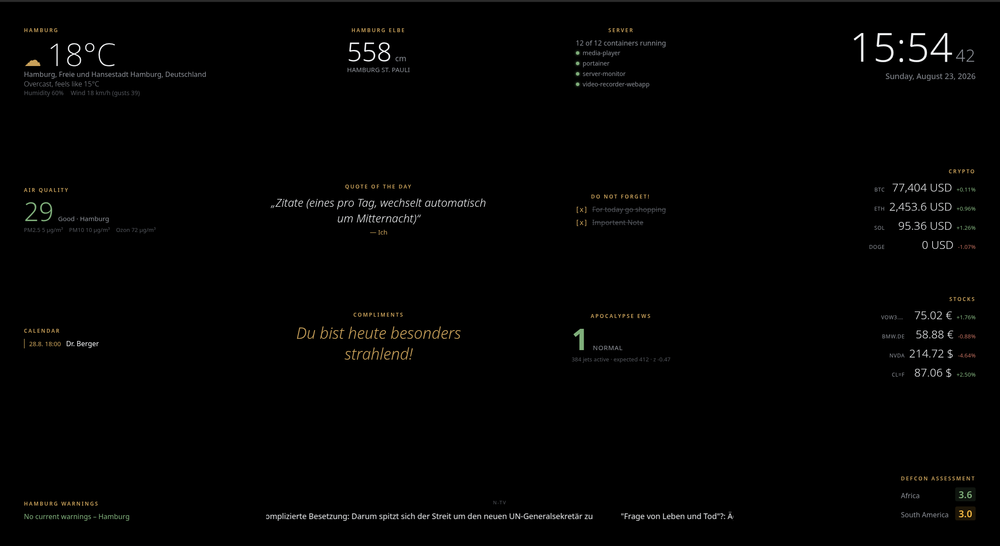

# Magic Mirror Mini 3000 – T-Display S3

*[English version: README.md](README.md)*

Ein MicroPython-Projekt für das LilyGO **T-Display S3** (ESP32-S3, 1.9"
ST7789, 320×170), das aus dem Board ein kleines "Magic Mirror"-Dashboard
macht. Widgets wechseln automatisch auf dem kleinen Display; WLAN und alle
Widget-Einstellungen werden über ein eingebautes Web-UI konfiguriert –
kein Cloud-Dienst, keine App, keine API-Keys nötig.

Dies ist eine kompakte Portierung eines größeren, Docker-basierten Magic-
Mirror-Dashboard-Projekts, angepasst für den eigenständigen Betrieb auf
einem einzelnen kleinen ESP32-S3-Board. Das Bild unten zeigt alle elf
Widgets in Aktion auf dem echten Gerät.



## Widgets

| Widget | Quelle | Details |
|---|---|---|
| Uhr | NTP (`pool.ntp.org`) | Sekundengenau, automatische EU-Sommerzeit, 12/24h umschaltbar |
| Wetter | Open-Meteo | Temperatur, gefühlte Temp., Wind, Luftfeuchte, Sturm/Hitze/Kälte-Warnzeile |
| Luftqualität | Open-Meteo Air Quality | EU-AQI (farbcodiert), PM2.5, PM10, Ozon |
| Amtliche Warnungen | warnung.bund.de (NINA/BBK) | DWD-Unwetter + Katastrophenschutz für den gewählten Kreis |
| Kalender | Google Kalender (private iCal-Adresse) | Bis zu 5 Termine, 14 Tage Vorschau, keine RRULE-Expansion |
| News | RSS/Atom-Feeds | Bis zu 3 Quellen, rotieren pro Refresh-Zyklus, als Lauftext angezeigt |
| Crypto | CoinGecko | Bis zu 4 Coins, Kurs + 24h-Änderung |
| Aktienkurse | Yahoo-Finance-Chart-Endpunkt | Bis zu 4 Symbole, Kurs + 24h-Änderung |
| Apocalypse EWS | ews.kylemcdonald.net (Snapshot-Feed) | Warnstufe 1–5, Flugzeuganzahl vs. gelernter Normalwert |
| DEFCON | eigene JSON-API auf [ai-defcon.com](https://ai-defcon.com) | Regionen-Liste, farbcodiert (niedriger = kritischer) |
| Compliments | rein lokal, kein Netzwerk | Zufälliger, aufmunternder Spruch aus einer im Web-UI editierbaren Liste |

Jedes Widget lässt sich einzeln im Web-UI ein-/ausschalten. Alle
Datenquellen sind kostenlos und brauchen keinen API-Key.

## ⚠️ Wichtig: Dieses Display ist kein SPI

Das T-Display S3 hängt sein ST7789-Display nicht wie die meisten
"generischen" ESP32-Boards per SPI an, sondern nutzt einen **8-Bit-
Parallelbus (Intel 8080 / i80)**. Die üblichen `st7789py`/`st7789_mpy`-
Treiber (SPI-only) funktionieren hier **nicht**. Dieses Projekt nutzt
stattdessen den Treiber [`s3lcd`](https://github.com/russhughes/s3lcd) von
russhughes, der genau für diesen Bus gebaut ist. Das bedeutet: du brauchst
eine **spezielle MicroPython-Firmware**, nicht die Standard-Firmware von
micropython.org.

### Du brauchst außerdem die Octal-SPIRAM-Firmware-Variante

Der auf dem T-Display S3 verbaute ESP32-S3-Chip (ein **ESP32-S3R8**) hat
8 MB **Octal**-SPI-PSRAM, nicht das gewöhnlichere Quad-SPI-PSRAM. Eine für
Quad-PSRAM gebaute Firmware (oder eine ganz ohne PSRAM-Unterstützung)
erkennt es nicht richtig. Ohne funktionierendes PSRAM reichen die internen
~250 KB SRAM nicht aus, um Display (braucht einen zusammenhängenden
~108-KB-Framebuffer), WLAN-Treiber und TLS/HTTPS-Verbindungen gleichzeitig
aktiv zu halten – du bekommst dann `MemoryError`/`ESP_ERR_NO_MEM`-Fehler
beim Anlegen des Displays oder bei der WLAN-Initialisierung.

Die Firmware kommt aus dem `firmware/`-Ordner des `s3lcd`-Repositories
(oder den Schwester-Repos `st7789s3_esp_lcd` / `t-display-s3`) – wähl
gezielt die Variante **`GENERIC_S3_OCT_16M`** (Octal-SPIRAM, 16 MB Flash),
nicht `GENERIC_S3_16M` (das ist Quad-SPIRAM und funktioniert auf diesem
Board nicht richtig).

**Eine bekannt funktionierende Kopie genau dieser Firmware liegt bereits
im [`firmware/`](firmware/)-Ordner dieses Repos bei**, falls sich die
Struktur der Original-Releases mal ändert – Details und der Link zurück
zur Originalquelle stehen in [`firmware/README_de.md`](firmware/README_de.md).

### Flashen

```bash
pip install esptool
esptool.py --chip esp32s3 --port /dev/ttyACM0 erase_flash
esptool.py --chip esp32s3 --port /dev/ttyACM0 --baud 921600 \
  --before default_reset --after hard_reset \
  write_flash -z --flash_mode dio --flash_freq 80m 0x0 firmware.bin
```

Board in den Flash-Modus versetzen: **BOOT** gedrückt halten, **RST**
antippen, **BOOT** loslassen. Port unter Linux meist
`/dev/ttyACM0`/`/dev/ttyUSB0`, unter Windows `COMx`, unter macOS
`/dev/cu.usbmodemXXXX`.

Nach dem Flashen im REPL prüfen:
```python
import gc
gc.mem_free()          # sollte mehrere Millionen Bytes zeigen, nicht ~250000
import os
os.uname()              # sollte "Octal-SPIRAM" erwähnen
```

## Projektdateien hochladen

```bash
pip install mpremote
mpremote connect /dev/ttyACM0 fs cp boot.py main.py tft_config.py display.py \
  wifi_manager.py config_store.py ntp_clock.py widgets.py webserver.py :
```

`urequests` liegt nicht als eigene Datei bei – es ist auf diesem
Firmware-Build bereits ein eingefrorenes Modul. Im Zweifel im REPL mit
`help('modules')` prüfen.

## Erster Start / WLAN-Einrichtung

1. Beim ersten Start (keine gespeicherten WLAN-Zugangsdaten) öffnet das
   Gerät einen eigenen Access Point: SSID `MagicMirror-Setup`, Passwort
   `mirror1234` (beides steht auch auf dem Display).
2. Mit diesem WLAN vom Handy/Notebook verbinden, Browser zur auf dem
   Display angezeigten IP öffnen (meist `http://192.168.4.1`).
3. Echte WLAN-SSID/Passwort eintragen, speichern, neu starten.
4. Nach dem Verbinden das Web-UI unter der neuen IP des Geräts öffnen
   (steht auf dem Boot-Screen, oder im Router nachschauen), um jedes
   Widget einzurichten: Ortssuche für Wetter/Luftqualität, PLZ-Suche für
   NINA-Warnungen, private iCal-Adresse für den Kalender, Coin-/Aktien-
   Symbole und die eigene DEFCON-Endpunkt-URL.

Das Web-UI ist immer erreichbar – unter `192.168.4.1` im Setup-AP-Modus,
oder unter der regulären Geräte-IP, sobald es mit deinem WLAN verbunden
ist. In der Karte "Setup Access Point" lassen sich auch SSID/Passwort des
eigenen Access Points (der bei fehlendem WLAN geöffnet wird) direkt im
Web-UI ändern.

**Etwas Geduld beim allerersten Start nach dem WLAN-Verbinden** (und nach
jedem Neustart): Das Gerät holt sich erst frische Daten für alle elf
Widgets, bevor es anfängt, durchzuwechseln – je nach Verbindung und Anzahl
aktivierter Widgets kann das einen Moment dauern. Die Uhr erscheint
schnell, die anderen Widgets aber erst, wenn dieser erste Abruf
abgeschlossen ist – das ist normal, kein Hänger.

## Tasten

Die beiden eingebauten Tasten des Boards (GPIO0/BOOT und GPIO14) lassen
dich manuell durch die Widgets blättern. Ein Tastendruck schaltet die
Anzeige **für den Rest dieser Sitzung** (bis zum nächsten Neustart) in den
manuellen Modus – GPIO0 blättert zurück, GPIO14 vor. Die Uhr läuft dabei
weiterhin sekundengenau, solange sie gerade angezeigt wird.

## Widgets ein-/ausschalten

Die Karte "Widgets" ganz oben im Web-UI hat eine Checkbox pro Widget.
Deaktivierte Widgets fehlen sowohl in der Auto-Rotation als auch beim
manuellen Durchblättern per Taste. Falls versehentlich alles deaktiviert
wird, zeigt das Gerät als Fallback nur die Uhr, damit das Display nicht
leer bleibt.

## Google Kalender einrichten

1. Google Kalender → Einstellungen → gewünschter Kalender → "Kalender
   integrieren".
2. Die "Geheime Adresse im iCal-Format" kopieren (nicht die öffentliche
   iCal-Adresse).
3. Im Web-UI bei der Karte "Calendar" einfügen, speichern.

Komplexe wiederkehrende Termine (RRULE mit Ausnahmen) werden nur anhand
ihres ursprünglichen Starttermins berücksichtigt, nicht vollständig
expandiert – für den Wandtafel-Überblick ausreichend, kein Ersatz für
eine vollständige Kalender-App.

## NINA-Warnungen einrichten

Bei erfolgloser Ortsnamen-Suche stattdessen mit Postleitzahl suchen – das
funktioniert zuverlässiger. Hinweis: Stadtstaaten (Hamburg, Berlin,
Bremen) haben in der zugrunde liegenden Such-API kein eigenes
"district"-Feld, da es über der Stadt selbst keine Kreis-Ebene gibt – die
Suche fällt in diesem Fall automatisch auf den Gemeinde-Code zurück.

## DEFCON einrichten

Das DEFCON-Widget ist für [ai-defcon.com](https://ai-defcon.com) gebaut,
ein eigenes Projekt von mir, das regionale Risikoeinschätzungen liefert
und das Ergebnis als einfache JSON-API bereitstellt – dort steht, wie man
Zugang bekommt und sich eine eigene Endpunkt-URL (und optional einen
API-Key) erzeugt.

Es funktioniert aber grundsätzlich jeder Endpunkt, der dieses JSON-Format
liefert, nicht nur ai-defcon.com:

```json
{
  "updated": "2026-08-18T10:00:00Z",
  "regions": [
    { "id": "germany", "name": "Germany", "value": 3.4 },
    { "id": "usa",     "name": "USA",     "value": 3.8 },
    { "id": "russia",  "name": "Russia",  "value": 1.8 }
  ]
}
```

`id` ist optional, `name` und `value` sind Pflicht. `value` folgt der
militärischen DEFCON-Konvention – **niedriger ist kritischer** (≤2 rot,
2–3,5 amber, >3,5 grün). `updated` wird vom Widget aktuell nicht
ausgewertet. Endpunkt-URL (und API-Key, falls deiner einen braucht –
wird als `X-API-Key`-Header mitgeschickt) in der Karte "DEFCON" im
Web-UI eintragen.

## Projektstruktur

```
main.py            Einstiegspunkt: WLAN, Webserver-Task, Anzeige-Loop, Tasten
boot.py             minimale Boot-Init
tft_config.py       Display-Bus-Konfiguration (i80/Parallelbus, s3lcd)
display.py          Framebuffer-freier Zeichen-Wrapper (zeichnet direkt in
                     s3lcds eigenen internen Puffer), Bitmap- + Vektor-Text
wifi_manager.py      STA-Verbindung mit AP-Fallback
config_store.py      JSON-Konfiguration laden/speichern (/config.json auf dem Gerät)
ntp_clock.py          NTP-Sync + lokale Zeit inkl. EU-Sommerzeit
widgets.py            Datenabruf (Open-Meteo, NINA, CoinGecko, Yahoo
                       Finance, EWS, DEFCON, iCal) + Zeichenroutinen
webserver.py           uasyncio-HTTP-Server + eingebettetes Web-UI
```

## Speicher & Zeichnen

`s3lcd.ESPLCD()` legt selbst schon einen internen Framebuffer der vollen
Displaygröße an (170×320×2 = 108.800 Bytes). `display.py` zeichnet
deshalb direkt mit den eingebauten Methoden von `ESPLCD` (`fill`, `rect`,
`line`, `circle`, `text`, `draw` für den Vektor-Font, …) statt einen
zweiten Python-seitigen Framebuffer anzulegen.

Die meisten Texte nutzen die auf diesem Firmware-Build eingefrorenen
Bitmap-Fonts (`vga1_8x8`, `vga1_16x16`, `vga1_bold_16x32`); die Uhr nutzt
gezielt einen Hershey-Vektorfont (`romans`) für eine glatte, große,
nicht-blockige Optik bei beliebiger Größe. Falls dein Firmware-Build
andere Modulnamen mitbringt, im REPL `help('modules')` prüfen und die
Importe oben in `display.py`/`widgets.py` entsprechend anpassen.

## Lokal ohne Hardware testen

In diesem Repo liegt kein Hardware-Simulator bei – Layout und
Schriftgrößen wurden iterativ auf echter Hardware im Laufe der Entwicklung
justiert. Wer künftige Layout-Arbeit beschleunigen will: ein kleines
Pillow-basiertes Render-Skript, das die Zeichen-API von `display.py`
nachbildet, würde das deutlich beschleunigen.

## Credits

- Display-Treiber: [`s3lcd`](https://github.com/russhughes/s3lcd) von
  russhughes (MIT-Lizenz)
- Wetter/Luftqualität: [Open-Meteo](https://open-meteo.com/)
- Amtliche Warnungen: [NINA/BBK](https://warnung.bund.de/)
- Ortssuche für Warnungen: [OpenPLZ API](https://openplzapi.org/)
- Krypto-Kurse: [CoinGecko](https://www.coingecko.com/)
- Aktienkurse: Yahoo-Finance-Chart-Endpunkt (inoffiziell)
- Apocalypse Early Warning System: [ews.kylemcdonald.net](https://ews.kylemcdonald.net/)
  von Kyle McDonald

## Lizenz

GPL-3.0 – siehe [LICENSE](LICENSE).
